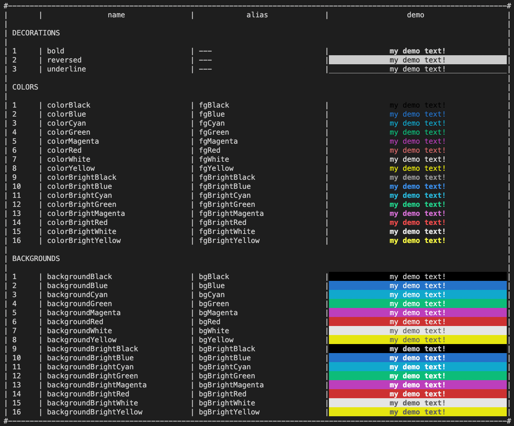

### readme: [Главная](./../README.md) | [EN](./README-EN.md)

# TERMINAL-STYLES-TEXT

> Утилита, которая позволяет задать стиль текста для терминала

## # Установка

Для тех кто использует NPM:

```sh
npm install terminal-styles-text
```

Для тех кто использует YARN:

```sh
yarn add terminal-styles-text
```

## # Демо

После установки пакета, в терминале можно вызвать команду `terminal-styles-text`, которая позволяет просмотреть как отображается цвета в вашем терминале

## # Доступные утилиты



## # Пример использования

```ts
import { fgGreen, fgRed, bold, reset } from 'terminal-styles-text';

export function createMessageSuccess(message: string) {
  return `${fgGreen}${bold}${message}${reset}`;
}

export function createMessageError(message: string) {
  return `${fgRed}${bold}${message}${reset}`;
}
```

1. Можно комбинировать разные утилиты, которые надо указывать перед текстом.
2. Обязательно надо завершать утилитой reset - текст, после нее становится дефолтным для терминала.
3. У утилит есть более короткие записи (алисы).

## # Лицензия

[MIT](./../LICENSE)
